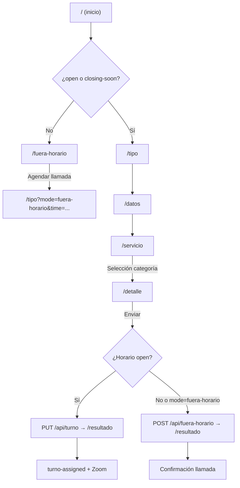

# Campus360 Hub


Plataforma web de atención y gestión de turnos para la **Universidad Técnica Particular de Loja (UTPL)**. Permite a estudiantes, aspirantes y visitantes solicitar servicios académicos mediante un asistente paso a paso: autogestión con guías interactivas, asignación de turnos en horario de atención, o registro de solicitudes fuera de horario para contacto telefónico posterior.

## Tabla de contenidos

- [Características principales](#características-principales)
- [Stack tecnológico](#stack-tecnológico)
- [Requisitos previos](#requisitos-previos)
- [Documentación técnica](#documentación-técnica)
- [Primeros pasos](#primeros-pasos)
- [Variables de entorno](#variables-de-entorno)
- [Arquitectura](#arquitectura)
- [Scripts disponibles](#scripts-disponibles)
- [API REST](#api-rest)
- [Pruebas y calidad de código](#pruebas-y-calidad-de-código)
- [Despliegue](#despliegue)
- [Solución de problemas](#solución-de-problemas)
- [Contribuir](#contribuir)

## Características principales

- **Asistente multipaso (wizard)** con 5 etapas: tipo de usuario, datos personales, categoría de servicio, detalle y resultado.
- **Autogestión con guías**: muchos trámites se resuelven con contenido guiado sin necesidad de asesor.
- **Asignación de turnos** en horario laboral, con numeración diaria (`001`, `002`, …) y reintentos ante condiciones de carrera.
- **Modo fuera de horario**: redirección automática cuando el centro está cerrado o en almuerzo; el usuario puede agendar una franja de llamada.
- **Integración con Zoom**: enlaces personalizados por turno para atención virtual.
- **Horario de atención Ecuador** (`America/Guayaquil`): Horario Normal lun–vie; Horario Extendido puede cubrir lun–dom cuando está habilitado.
- **Rate limiting** en APIs (30 peticiones/minuto por IP) y sanitización de inputs.
- **Diseño institucional UTPL** con Tailwind CSS, animaciones Framer Motion y advertencia en dispositivos móviles.

## Stack tecnológico

| Capa | Tecnología |
|------|------------|
| **Lenguaje** | TypeScript 5 |
| **Framework** | [Next.js](https://nextjs.org) 16 (App Router) |
| **UI** | React 19, Tailwind CSS 4, Framer Motion 12 |
| **Iconos** | Lucide React |
| **Banderas** | react-world-flags |
| **Datos / caché** | [Upstash Redis](https://upstash.com/docs/redis) |
| **Cola asíncrona** | [Upstash QStash](https://upstash.com/docs/qstash) |
| **Backend** | Route Handlers de Next.js |
| **Integraciones** | Microsoft Power Automate (turnos, notificaciones, autogestión, horarios) |
| **Videollamadas** | Zoom (enlaces deep link y web) |
| **Gestor de paquetes** | pnpm 9+ |
| **Linting / formato** | ESLint 9, Prettier 3 |
| **Despliegue recomendado** | Vercel (plataforma nativa para Next.js) |

Detalle ampliado: [docs/stack.md](docs/stack.md).

## Requisitos previos

- **Node.js** 22.x (ver `engines` en `package.json`)
- **pnpm** 9+ (recomendado; el proyecto usa `pnpm-lock.yaml`)
- Cuenta **Upstash Redis** (o Vercel KV) y flujos **Power Automate** configurados
- (Opcional) ID de reunión **Zoom** y token **QStash** para producción

Detalle ampliado: [docs/prerequisites.md](docs/prerequisites.md).

## Documentación técnica

| Documento | Contenido |
|-----------|-----------|
| [docs/informe-tecnico-canal-virtual.md](docs/informe-tecnico-canal-virtual.md) | **Informe institucional** — plataforma, alojamiento, datos (respaldo URL) |
| [docs/stack.md](docs/stack.md) | Stack, arquitectura de datos y tecnologías retiradas |
| [docs/prerequisites.md](docs/prerequisites.md) | Node, pnpm, cuentas externas y variables de entorno |
| [docs/getting-started.md](docs/getting-started.md) | Guía de instalación paso a paso |
| [docs/architecture.md](docs/architecture.md) | Estructura del proyecto y flujos |
| [docs/deployment.md](docs/deployment.md) | Despliegue en Vercel y checklist de producción |
| [docs/api/](docs/api/README.md) | Referencia de endpoints REST |
| [docs/troubleshooting.md](docs/troubleshooting.md) | Guía ampliada de solución de problemas |
| [docs/archive/db-schema.md](docs/archive/db-schema.md) | Esquema histórico Prisma/PostgreSQL (archivado) |

Índice completo: [docs/tech-index.md](docs/tech-index.md).

## Primeros pasos

Guía extendida: [docs/getting-started.md](docs/getting-started.md).

### 1. Clonar el repositorio

```bash
git clone https://github.com/JomiChCal/campus360-hub.git
cd campus360-hub
```

### 2. Instalar dependencias

```bash
pnpm install
```

### 3. Configurar variables de entorno

```bash
cp .env.example .env.local
```

Completa los valores en `.env.local`. Referencia completa en [Variables de entorno](#variables-de-entorno).

### 4. Iniciar el servidor de desarrollo

```bash
pnpm dev
```

Abre [http://localhost:3000](http://localhost:3000). La raíz redirige según el horario:

- **Horario abierto** → `/tipo` (inicio del wizard)
- **Almuerzo o fuera de horario** → `/fuera-horario`

Para probar sin depender del reloj, en `.env.local`:

```env
NEXT_PUBLIC_MOCK_BUSINESS_HOURS=open
```

## Variables de entorno

Plantilla con placeholders: [`.env.example`](.env.example).

| Variable | Requerida | Descripción |
|----------|-----------|-------------|
| `UPSTASH_REDIS_REST_URL` | Sí* | URL REST de Upstash Redis |
| `UPSTASH_REDIS_REST_TOKEN` | Sí* | Token REST de Upstash Redis |
| `KV_REST_API_URL` | Alt. | Alias Vercel KV (en lugar de `UPSTASH_REDIS_REST_URL`) |
| `KV_REST_API_TOKEN` | Alt. | Alias Vercel KV (en lugar de `UPSTASH_REDIS_REST_TOKEN`) |
| `PA_CREAR_TURNO_URL` | Sí | Webhook PA: crear turno |
| `PA_CREAR_AUTOGESTION_URL` | Sí | Webhook PA: autogestión |
| `PA_CREAR_FUERA_HORARIO_URL` | Sí | Webhook PA: solicitud fuera de horario |
| `PA_ACTUALIZAR_TURNO_URL` | Sí | Webhook PA: caducar/actualizar turno |
| `MICROSOFT_AVISOS_FLOW_URL` | Sí | Flujo PA: lectura de avisos (banner) |
| `MICROSOFT_CATEGORIAS_FLOW_URL` | Sí | Flujo PA: categorías del wizard (fallback) |
| `REFRESH_SECRET` | Sí | Bearer para `POST /api/*/refresh` |
| `QSTASH_TOKEN` | Prod. | Cola de turnos (no necesario en `localhost`) |
| `NEXT_PUBLIC_APP_URL` | Prod. | URL pública de la app (default: `http://localhost:3000`) |
| `ZOOM_MEETING_ID` | No | ID de reunión Zoom (default en código: `89419717339`) |
| `NEXT_PUBLIC_MOCK_BUSINESS_HOURS` | Dev. | `open` \| `lunch` \| `after-hours` — solo desarrollo |

\* Redis: basta con el par Upstash **o** el par KV.

Variables de plataforma (no configurar manualmente): `NODE_ENV`, `VERCEL_ENV`.

## Arquitectura

### Estructura de directorios

> Detalle ampliado en [`docs/architecture.md`](docs/architecture.md).

```
campus360-hub/
├── proxy.ts                      # Redirecciones por horario (Next.js 16)
├── app/                          # App Router de Next.js
│   ├── layout.tsx                # Layout raíz
│   ├── page.tsx                  # Redirección según horario
│   ├── globals.css               # Estilos globales
│   ├── fuera-horario/            # Pantalla fuera de horario
│   ├── (form)/                   # Grupo de rutas del wizard
│   │   ├── layout.tsx            # Shell del formulario
│   │   ├── tipo/                 # Paso 1: estudiante / aspirante
│   │   ├── datos/                # Paso 2: datos personales
│   │   ├── servicio/             # Paso 3: catálogo de categorías
│   │   ├── detalle/              # Paso 4: requerimiento + texto libre
│   │   └── resultado/            # Paso 5: turno o autogestión
│   └── api/                      # Route Handlers
├── components/
│   ├── wizard/                   # Componentes del wizard
│   ├── ui/                       # Inputs, selects, etc.
│   └── ...
├── contexts/
│   └── FormContext.tsx           # Estado global del wizard
├── hooks/                        # Lógica reutilizable del wizard
├── lib/
│   ├── schedule-core.ts          # Lógica pura de horarios Ecuador
│   ├── business-hours.ts         # API cliente de horarios
│   ├── validation.ts             # Validación de formularios
│   └── server/                   # Redis, Power Automate, rate limit
│       ├── schedule-service.ts
│       ├── power-automate.ts
│       └── api-utilities.ts
└── tailwind.config.ts            # Paleta de colores UTPL
```

### Flujo del usuario



### Horario de atención

Zona horaria: **America/Guayaquil**. Configuración dinámica desde SharePoint (`Config-horarios`) vía `POST /api/refresh-config`.

| Estado | Condición |
|--------|-----------|
| `open` | Dentro de franja activa hasta **cierre − 10 min** |
| `closing-soon` | Últimos 10 min antes del cierre PA (modal en wizard) |
| `lunch` | Hueco entre mañana y tarde (solo Horario Normal dual) |
| `after-hours` | Fuera de franja, fin de semana sin Extendido habilitado, o ambos perfiles deshabilitados |

Perfiles:

- **Horario Normal** (dual): solo **lunes a viernes**. Si ambos perfiles están `habilitado=Si`, gana Normal entre semana.
- **Horario Extendido** (continuo o dual): puede operar **lunes a domingo** cuando `habilitado=Si`. En **sábado y domingo** solo aplica Extendido; Normal no se evalúa en fin de semana.

Para abrir solo fines de semana: habilitar Extendido y mantener Normal activo entre semana. Para un periodo extendido de toda la semana: habilitar Extendido y deshabilitar Normal en Power Apps.

`proxy.ts` redirige `/` y bloquea las rutas del wizard en `lunch` y `after-hours` (salvo `?mode=fuera-horario`). El wizard permite `open` y `closing-soon`; `BusinessHoursWatcher` complementa con polling en cliente.

## Scripts disponibles

| Comando | Descripción |
|---------|-------------|
| `pnpm dev` | Servidor de desarrollo |
| `pnpm build` | Compilación de producción |
| `pnpm start` | Servidor de producción |
| `pnpm lint` | ESLint |
| `pnpm lint:fix` | ESLint con correcciones automáticas |
| `pnpm format` | Prettier (escribe cambios) |
| `pnpm format:check` | Prettier (solo verificación) |
| `pnpm lint:all` | ESLint + Prettier check |

## API REST

La mayoría de rutas aplican **rate limiting** (30 req/min por IP) y validación. Excepciones sin rate limit: `turno/caducar`, `cerrado`, `qstash-worker`.

Documentación detallada por endpoint: [`docs/api/`](docs/api/README.md).

## `PUT /api/turno` — Asignar o reasignar turno

Query param obligatorio: `?action=asignar` (valida horario y campos) o `?action=reasignar` (omite validación de horario).

```json
{
  "nombres": "Juan",
  "apellidos": "Pérez",
  "cedula": "1234567890",
  "email": "juan@ejemplo.com",
  "telefono": "0991234567",
  "servicio": "Matrícula",
  "modalidad": "Presencial",
  "origen": "wizard-servicio",
  "pais": "Ecuador",
  "requestId": "optional-uuid",
  "freeText": "",
  "prefijoTelefonico": "+593"
}
```

**Respuesta 200:**

```json
{
  "success": true,
  "turnoNumber": "A-042",
  "zoomLink": "zoommtg://...",
  "webZoomLink": "https://...",
  "requestId": "optional-uuid"
}
```

**403** si `action=asignar` y el centro está fuera de horario (hora Ecuador). En producción encola el envío a Power Automate vía QStash (`POST /api/qstash-worker`); en localhost llama al webhook directamente.

## `POST /api/turno/caducar` — Marcar turno caducado

Usado al generar un nuevo turno desde la pantalla de resultado. Actualiza estado en Power Automate si `PA_ACTUALIZAR_TURNO_URL` está configurado.

```json
{
  "requestId": "uuid-del-turno",
  "turno": "A-042",
  "nuevoEstado": "CADUCADO",
  "fechaCaducidad": "2026-07-06T21:00:00.000Z"
}
```

**Respuesta:** `{ "success": true, "message": "Turno marcado como caducado" }`

## `POST /api/qstash-worker` — Worker interno QStash

No llamar desde el cliente. Upstash QStash invoca esta ruta al procesar la cola `turnos` y reenvía el payload a Power Automate (`WEBHOOK_URLS.crearTurno`). Requiere `QSTASH_TOKEN` en el servidor que encola.

## `POST /api/autogestion` — Registrar autogestión

```json
{
  "fecha": "06/07/2026, 10:30:00",
  "nombres": "María López",
  "cedula": "1234567890",
  "email": "maria@ejemplo.com",
  "telefono": "0991234567",
  "servicio": "Horarios de clases",
  "resultado": "ÉXITO",
  "pais": "Ecuador",
  "modalidad": "-",
  "requestId": "optional-uuid"
}
```

**Respuesta:** `{ "success": true, "message": "Autogestión guardada" }`

## `POST /api/fuera-horario` — Solicitar llamada

```json
{
  "fecha": "06/07/2026, 10:30:00",
  "horaContactoPreferida": "09:00 - 10:00",
  "nombres": "Carlos Ruiz",
  "cedula": "1234567890",
  "email": "carlos@ejemplo.com",
  "telefono": "0991234567",
  "servicio": "Información General",
  "origen": "fuera-horario",
  "pais": "Ecuador",
  "modalidad": "-",
  "freeText": ""
}
```

**Respuesta:** `{ "success": true, "message": "Solicitud fuera de horario guardada" }`

## `GET /api/avisos` — Avisos del banner en `/tipo`

Devuelve mensajes activos desde SharePoint (vía Power Automate), con caché compartida en Redis.

```json
{
  "messages": [
    {
      "title": "Renueva tu beca.",
      "message": "Renueva tu beca desde el 23 de abril al 3 de mayo.",
      "link": {
        "label": "ingresa aquí",
        "url": "https://becas.utpl.edu.ec/"
      }
    }
  ],
  "rotationIntervalMs": 20000
}
```

Si no hay avisos activos o falla la integración, `messages` es un array vacío y el banner no se muestra.

## `POST /api/avisos/refresh` — Sincronizar avisos desde Power Automate

Actualiza Redis al crear o modificar items en SharePoint (`Bannerconfig`). Requiere autenticación Bearer.

**Headers:**

```
Content-Type: application/json
Authorization: Bearer <REFRESH_SECRET>
```

**Body:** array JSON con el mismo shape que devuelve el flujo de lectura de SharePoint (`body('Obtener_elementos')?['value']`).

**Respuesta:**

```json
{ "success": true, "count": 2 }
```

## `GET /api/categorias` — Categorías del wizard en `/servicio`

Query param obligatorio: `audience=continuo` (Ya soy UTPL +) o `audience=nuevo` (Quiero ser UTPL +).

```json
{
  "categories": [
    {
      "id": "matriculas-y-tramites",
      "title": "Matrículas y trámites",
      "description": "Renovación, inscripción y procesos administrativos",
      "iconLabel": "Libro – matrículas y trámites",
      "studentType": "continuo"
    }
  ]
}
```

Si Redis no tiene datos, se usa `MICROSOFT_CATEGORIAS_FLOW_URL` como fallback (TTL 10 min). Si todo falla, `categories` es `[]`.

## `POST /api/categorias/refresh` — Sincronizar categorías desde Power Automate

Igual que avisos: Bearer `REFRESH_SECRET`, body = array de la lista SharePoint `CategoriasWizard`.

**Flujo Power Automate (sync):**

1. Disparador: *Cuando se crea o modifica un elemento* en `Bannerconfig` o `CategoriasWizard`.
2. Acción: *Obtener elementos* de la misma lista.
3. Acción HTTP POST a `https://<dominio>/api/avisos/refresh` o `/api/categorias/refresh` con los headers anteriores y body `body('Obtener_elementos')?['value']`.

Los cambios son visibles en segundos tras el POST refresh y una recarga de página (GET lee Redis).

**Pruebas locales:**

```bash
curl -X POST "http://localhost:3000/api/avisos/refresh" \
  -H "Authorization: Bearer $REFRESH_SECRET" \
  -H "Content-Type: application/json" \
  -d '[{"Title":"Test","field_1":"Mensaje","activar":{"Value":"Activado"}}]'

curl "http://localhost:3000/api/categorias?audience=continuo"

curl -X POST "http://localhost:3000/api/categorias/refresh" \
  -H "Authorization: Bearer $REFRESH_SECRET" \
  -H "Content-Type: application/json" \
  -d '[{"Title":"Pagos","Activo":{"Value":"Activado"},"TipoEstudiante":{"Value":"Continuo"},"Icono":{"Value":"Dinero – pagos y becas"}}]'
```

## `GET /api/schedule-config` — Configuración de horarios

Devuelve horarios almacenados en Redis y el estado actual (`open`, `closing-soon`, `lunch`, `after-hours`).

```json
{
  "horarios": {
    "Horario Normal": {
      "horaAperturaM": "08:00",
      "horaCierreM": "13:00",
      "horarioAperturaT": "15:00",
      "horarioCierreT": "18:00",
      "modo": "dual",
      "habilitado": true
    }
  },
  "resolved": { "hasActiveSchedule": true, "titulo": "Horario Normal" },
  "state": "open",
  "updatedAt": "2026-06-19T12:00:00.000Z",
  "meta": {
    "source": "kv",
    "redisEnabled": true,
    "mockActive": false,
    "ecuadorTime": "10:30",
    "isWeekday": true
  }
}
```

`state`: `open` | `closing-soon` | `lunch` | `after-hours`. `meta.source`: `kv` | `empty` | `mock`.

## `POST /api/refresh-config` — Sincronizar horarios desde Power Automate

Upsert de **una fila** por request (trigger de SharePoint `Config-horarios`).

**Headers:** `Content-Type: application/json`, `Authorization: Bearer <REFRESH_SECRET>`

**Body (campos del trigger):**

```json
{
  "Titulo": "Horario Normal",
  "HoraAperturaM": "08:00",
  "HoraCierreM": "13:00",
  "HorarioAperturaT": "15:00",
  "HorarioCierreT": "18:00",
  "habilitado": "Si"
}
```

**Respuesta 200:**

```json
{
  "success": true,
  "resolved": { "hasActiveSchedule": true, "titulo": "Horario Normal" },
  "horarios": { "Horario Normal": { "...": "..." } },
  "updatedAt": "2026-06-19T12:00:00.000Z"
}
```

**Prueba local:**

```bash
curl -X POST "http://localhost:3000/api/refresh-config" \
  -H "Authorization: Bearer $REFRESH_SECRET" \
  -H "Content-Type: application/json" \
  -d '{"Titulo":"Horario Normal","HoraAperturaM":"08:00","HoraCierreM":"13:00","HorarioAperturaT":"15:00","HorarioCierreT":"18:00","habilitado":"Si"}'

curl "http://localhost:3000/api/schedule-config"
```

**Power Automate:** actualizar Bearer de `campus360-pa-horario-2026` a `REFRESH_SECRET` (mismo que banner/categorías).

En producción, quitar `NEXT_PUBLIC_MOCK_BUSINESS_HOURS=open` para que aplique el horario real.

## `GET /api/cerrado` · `POST /api/cerrado` — Flag de cierre memoria

Estado en memoria del proceso (`cerrado: boolean`). No persiste entre reinicios ni instancias serverless. Sin autenticación ni rate limit.

**GET** → `{ "cerrado": false }`

**POST** body `{ "cerrado": true }` → `{ "cerrado": true }` (400 si no es boolean).

## Pruebas y calidad de código

```bash
pnpm lint
pnpm lint:fix
pnpm format:check
pnpm format
```

### Verificación manual

1. Flujo completo **estudiante** con servicio `GUIA`
2. Flujo **estudiante** con servicio `TURNO` → número + enlace Zoom
3. Flujo **aspirante** (menos pasos)
4. Fuera de horario → redirección a `/fuera-horario`
5. Agendar llamada → wizard con `?mode=fuera-horario`

## Despliegue

**URL de producción:** https://campus360-hub-eight.vercel.app

Guía operativa: [docs/deployment.md](docs/deployment.md).

### Vercel recomendado

1. Importa el repositorio en [vercel.com](https://vercel.com)
2. Framework preset: **Next.js**
3. Node.js version: **22.x**
4. Añade variables de entorno (ver [docs/deployment.md](docs/deployment.md))
5. Despliega

### Build local

```bash
pnpm build
pnpm start
```

## Solución de problemas

Guía ampliada con 13+ escenarios: [docs/troubleshooting.md](docs/troubleshooting.md).

Problemas frecuentes en desarrollo:

- **Redis vacío** — configura credenciales y ejecuta endpoints `*/refresh`
- **429 rate limit** — espera 60 s o reduce frecuencia de peticiones
- **Redirección a `/fuera-horario`** — usa `NEXT_PUBLIC_MOCK_BUSINESS_HOURS=open` en local

## Contribuir

1. Haz fork del repositorio
2. Crea una rama: `git checkout -b feature/mi-mejora`
3. Asegúrate de que `pnpm lint` pase
4. Abre un Pull Request

## Licencia

Proyecto privado de la UTPL. Consulta con el equipo propietario antes de redistribuir.

---

**Universidad Técnica Particular de Loja** — *decide ser +*

