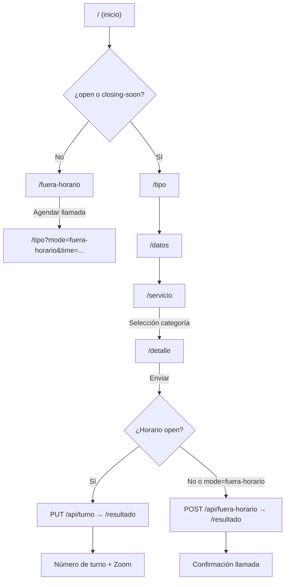

# Campus360 Hub


Plataforma web de atención y gestión de turnos para la **Universidad Técnica Particular de Loja (UTPL)**. Permite a estudiantes, aspirantes y visitantes solicitar servicios académicos y administrativos mediante un asistente paso a paso: autogestión con guías interactivas, asignación de turnos en horarios de atención, o registro de solicitudes fuera de horario para contacto telefónico posterior y personalizado.

## Tabla de contenidos

- [Características principales](#características-principales)
- [Stack tecnológico](#stack-tecnológico)
- [Arquitectura de datos](#arquitectura-de-datos)
- [Requisitos previos](#requisitos-previos)
- [Primeros pasos](#primeros-pasos)
- [Arquitectura](#arquitectura)
- [Variables de entorno](#variables-de-entorno)
- [Scripts disponibles](#scripts-disponibles)
- [API REST](#api-rest)
- [Pruebas y calidad de código](#pruebas-y-calidad-de-código)
- [Despliegue](#despliegue)
- [Solución de problemas](#solución-de-problemas)
- [Documentación técnica](#documentación-técnica)
- [Contribuir](#contribuir)

---

## Características principales

- **Asistente multipaso (wizard)** con 5 etapas: tipo de usuario, datos personales, categoría de servicio, detalle y resultado.
- **Autogestión con guías**: muchos trámites se resuelven con contenido guiado sin necesidad de asesor.
- **Asignación de turnos** en horario laboral, con numeración diaria (`001`, `002`, …) y reintentos ante condiciones de carrera.
- **Modo fuera de horario**: redirección automática cuando el centro está cerrado o en almuerzo; el usuario puede agendar una franja de llamada.
- **Integración con Zoom**: enlaces personalizados por turno para atención virtual.
- **Horario de atención Ecuador** (`America/Guayaquil`): Horario Normal lun–vie; Horario Extendido puede cubrir lun–dom cuando está habilitado.
- **Rate limiting** en APIs (30 peticiones/minuto por IP) y sanitización de inputs.
- **Diseño institucional UTPL** con Tailwind CSS, animaciones Framer Motion y advertencia en dispositivos móviles.

---

## Stack tecnológico

| Capa | Tecnología |
|------|------------|
| **Lenguaje** | TypeScript 5 |
| **Framework** | [Next.js](https://nextjs.org) 16.2 (App Router) |
| **UI** | React 19, Tailwind CSS 4, Framer Motion 12 |
| **Iconos** | Lucide React |
| **Banderas** | react-world-flags |
| **Datos / caché** | [Upstash Redis](https://upstash.com/docs/redis) |
| **Cola asíncrona** | [Upstash QStash](https://upstash.com/docs/qstash) |
| **Backend** | Route Handlers de Next.js |
| **Integraciones** | Microsoft Power Automate (turnos, notificaciones, autogestión, horarios) |
| **Videollamadas** | Zoom (enlaces deep link y web) |
| **Gestor de paquetes** | pnpm 9+ |
| **Linting / formato** | ESLint 9, Prettier 3 |
| **Despliegue recomendado** | Vercel (plataforma nativa para Next.js) |

Detalle ampliado: [docs/stack.md](docs/stack.md).

---

## Arquitectura de datos

No hay base de datos relacional ni ORM en el proyecto actual.

| Dato | Ubicación |
|------|-----------|
| **Horarios, avisos, categorías** | SharePoint → Power Automate → caché **Upstash Redis** |
| **Numeración diaria de turnos** | **Upstash Redis** (`turno:DD/MM/YYYY`, TTL 24 h) |
| **Registros de atención** | **Power Automate** → backend institucional UTPL |
| **Envío de turnos en producción** | **QStash** → `/api/qstash-worker` → Power Automate |

En desarrollo local (`localhost`), los turnos se envían a Power Automate directamente sin QStash.

Esquema histórico Prisma/PostgreSQL (ya no en uso): [docs/archive/db-schema.md](docs/archive/db-schema.md).

---

## Requisitos previos

- **Node.js** 22.x (ver `engines` en `package.json`)
- **pnpm** 9+ (recomendado; el proyecto usa `pnpm-lock.yaml`)
- Cuenta **Upstash Redis** (o Vercel KV) y flujos **Power Automate** configurados
- (Opcional) ID de reunión **Zoom** y token **QStash** para producción

Detalle ampliado: [docs/prerequisites.md](docs/prerequisites.md).

---

## Primeros pasos

### 1. Clonar el repositorio

```bash
git clone https://github.com/JomiChCal/campus360-hub.git
cd campus360-hub
```

### 2. Instalar dependencias

```bash
pnpm install
```

### 3. Configurar variables de entorno

Crea un archivo `.env.local` en la raíz del proyecto con las credenciales de Redis, Power Automate y demás integraciones.

**Mínimo para desarrollo local:**

```env
UPSTASH_REDIS_REST_URL=https://xxx.upstash.io
UPSTASH_REDIS_REST_TOKEN=xxx
PA_CREAR_TURNO_URL=https://prod-xxx.logic.azure.com/...
PA_CREAR_AUTOGESTION_URL=https://prod-xxx.logic.azure.com/...
PA_CREAR_FUERA_HORARIO_URL=https://prod-xxx.logic.azure.com/...
MICROSOFT_AVISOS_FLOW_URL=https://prod-xxx.logic.azure.com/...
MICROSOFT_CATEGORIAS_FLOW_URL=https://prod-xxx.logic.azure.com/...
REFRESH_SECRET=your_long_random_secret
ZOOM_MEETING_ID=89419717339
NEXT_PUBLIC_MOCK_BUSINESS_HOURS=open
```

`QSTASH_TOKEN` no es obligatorio en local: en `localhost` los turnos se envían a Power Automate directamente.

### 4. Iniciar el servidor de desarrollo

```bash
pnpm dev
```

Abre [http://localhost:3000](http://localhost:3000). La raíz redirige según el horario:

- **Horario abierto** → `/tipo` (inicio del wizard)
- **Almuerzo o fuera de horario** → `/fuera-horario`

Para probar sin depender del reloj:

```env
NEXT_PUBLIC_MOCK_BUSINESS_HOURS=open
```

Guía extendida: [docs/getting-started.md](docs/getting-started.md).

---

## Variables de entorno

Referencia completa: [docs/env-vars.md](docs/env-vars.md).

| Variable | Uso |
|----------|-----|
| `UPSTASH_REDIS_REST_URL` / `UPSTASH_REDIS_REST_TOKEN` | Redis (turnos, horarios, avisos, categorías) |
| `PA_*` / `MICROSOFT_*` | Webhooks de Power Automate |
| `REFRESH_SECRET` | Bearer para endpoints `*/refresh` |
| `QSTASH_TOKEN` | Cola de turnos (producción) |
| `ZOOM_MEETING_ID` | ID de reunión Zoom |
| `NEXT_PUBLIC_APP_URL` | URL pública (QStash en producción) |
| `NEXT_PUBLIC_MOCK_BUSINESS_HOURS` | Solo desarrollo (`open`, `lunch`, `after-hours`) |

---

## Arquitectura

### Estructura de directorios

```
campus360-hub/
├── proxy.ts                      # Redirecciones por horario
├── app/
│   ├── layout.tsx                # Layout raíz
│   ├── page.tsx                  # Redirección según horario
│   ├── globals.css
│   ├── fuera-horario/            # Pantalla fuera de horario
│   ├── (form)/                   # Grupo de rutas del wizard
│   │   ├── tipo/                 # Paso 1: estudiante / aspirante
│   │   ├── datos/                # Paso 2: datos personales
│   │   ├── servicio/             # Paso 3: categorías (API)
│   │   ├── detalle/              # Paso 4: detalle del requerimiento
│   │   └── resultado/            # Paso 5: turno, llamada o autogestión
│   └── api/                      # Route Handlers REST
├── components/
│   ├── wizard/                   # Componentes del wizard
│   ├── ui/                       # Input, Select, etc.
│   └── ...
├── contexts/
│   └── FormContext.tsx           # Estado global del wizard
├── lib/
│   ├── schedule-core.ts          # Lógica de horarios (Ecuador)
│   └── server/                   # Redis, Power Automate, QStash, Zoom
└── tailwind.config.ts
```

Detalle ampliado: [docs/architecture.md](docs/architecture.md).

### Flujo del usuario



### Horario de atención

Zona horaria: **America/Guayaquil**. Configuración dinámica desde SharePoint (`Config-horarios`) vía `POST /api/refresh-config`.

| Estado | Condición |
|--------|-----------|
| `open` | Dentro de franja activa hasta **cierre − 10 min** |
| `closing-soon` | Últimos 10 min antes del cierre PA (modal en wizard) |
| `lunch` | Hueco entre mañana y tarde (solo Horario Normal dual) |
| `after-hours` | Fuera de franja, fin de semana sin Extendido habilitado, o ambos perfiles deshabilitados |

Perfiles:

- **Horario Normal** (dual): solo **lunes a viernes**. Si ambos perfiles están `habilitado=Si`, gana Normal entre semana.
- **Horario Extendido** (continuo o dual): puede operar **lunes a domingo** cuando `habilitado=Si`. En **sábado y domingo** solo aplica Extendido; Normal no se evalúa en fin de semana.

Para abrir solo fines de semana: habilitar Extendido y mantener Normal activo entre semana. Para un periodo extendido de toda la semana: habilitar Extendido y deshabilitar Normal en Power Apps.

El `proxy.ts` redirige a `/fuera-horario` en `lunch` y `after-hours`. El wizard permite `open` y `closing-soon` (o `?mode=fuera-horario`). En `closing-soon` no se asignan turnos nuevos.

---

## Scripts disponibles

| Comando | Descripción |
|---------|-------------|
| `pnpm dev` | Servidor de desarrollo (Turbopack) |
| `pnpm build` | Compilación de producción |
| `pnpm start` | Servidor de producción |
| `pnpm lint` | ESLint |
| `pnpm lint:fix` | ESLint con correcciones |
| `pnpm format` | Prettier |
| `pnpm format:check` | Prettier (solo verificación) |
| `pnpm lint:all` | ESLint + Prettier check |

---

## API REST

Todas las rutas aplican **rate limiting** (30 req/min por IP) y validación. Excepciones sin rate limit: `turno/caducar`, `cerrado`, `qstash-worker`.

Documentación detallada por endpoint: [`docs/api/`](docs/api/README.md). Visión general: [docs/api/overview.md](docs/api/overview.md).

---

## Pruebas y calidad de código

```bash
pnpm lint
pnpm lint:fix
pnpm format:check
pnpm format
```

### Verificación manual

1. Flujo completo **estudiante** → categoría → detalle → turno asignado + enlace Zoom
2. Flujo **aspirante** (5 pasos)
3. Fuera de horario → redirección a `/fuera-horario`
4. Agendar llamada → wizard con `?mode=fuera-horario`
5. Banner de avisos visible en `/tipo` (requiere sync Redis)

---

## Despliegue

**URL de producción:** https://campus360-hub-eight.vercel.app

Guía operativa: [docs/deployment.md](docs/deployment.md).

### Vercel (recomendado)

1. Importa el repositorio en [vercel.com](https://vercel.com)
2. Framework preset: **Next.js**
3. Node.js version: **22.x**
4. Añade variables de entorno (ver [docs/deployment.md](docs/deployment.md))
5. Despliega

### Build local

```bash
pnpm build
pnpm start
```

---

## Solución de problemas

### Redis no disponible o datos vacíos

**Causa:** Credenciales de Upstash no configuradas, o caché sin sincronizar desde Power Automate.

**Solución:** Verifica `.env.local`, ejecuta los endpoints `*/refresh` con `REFRESH_SECRET` y reinicia `pnpm dev`.

Guía ampliada: [docs/troubleshooting.md](docs/troubleshooting.md).

### Rate limit excedido (429)

**Causa:** Más de 30 peticiones/minuto desde la misma IP.

**Solución:** Espera un minuto o ajusta en `lib/server/api-utilities.ts`.

### Wizard redirige siempre a `/fuera-horario`

**Causa:** Fuera de horario o `NEXT_PUBLIC_MOCK_BUSINESS_HOURS` no está en `open`.

**Solución:**

```env
NEXT_PUBLIC_MOCK_BUSINESS_HOURS=open
```

---

## Documentación técnica

Documentación ampliada en la carpeta [`docs/`](docs/tech-index.md):

| Documento | Para quién |
|-----------|------------|
| [informe-tecnico-canal-virtual.md](docs/informe-tecnico-canal-virtual.md) | UTPL — informe institucional (plataforma, alojamiento, URL) |
| [architecture.md](docs/architecture.md) | Desarrolladores — estructura y flujos |
| [api/](docs/api/README.md) | Desarrolladores — referencia REST |
| [troubleshooting.md](docs/troubleshooting.md) | Soporte — guía ampliada de problemas |

Índice completo: [docs/tech-index.md](docs/tech-index.md).

---

## Contribuir

1. Haz fork del repositorio
2. Crea una rama: `git checkout -b feature/mi-mejora`
3. Asegúrate de que `pnpm lint` pase
4. Abre un Pull Request

---

## Licencia

Proyecto privado de la UTPL. Consulta con el equipo propietario antes de redistribuir.

---

**Universidad Técnica Particular de Loja** — *decide ser +*
