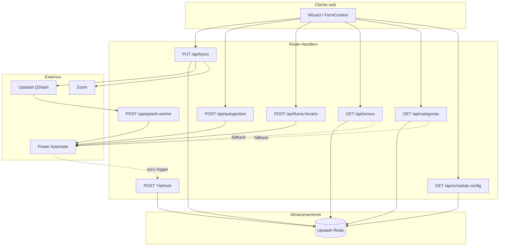

# API REST — Visión general

Referencia de alto nivel de las APIs de Campus360 Hub. Detalle por endpoint en [README.md](./README.md) y archivos individuales de esta carpeta.

**URL base (producción):** `https://campus360-hub-eight.vercel.app`

---

## Diagrama de flujo



---

## Índice de endpoints

| Endpoint | Método | Auth | Propósito |
|----------|--------|------|-----------|
| `/api/turno` | PUT | — | Asignar turno |
| `/api/turno/caducar` | POST | — | Caducar turno en PA |
| `/api/qstash-worker` | POST | QStash* | Worker interno de cola |
| `/api/autogestion` | POST | — | Registrar autogestión |
| `/api/fuera-horario` | POST | — | Solicitud de llamada |
| `/api/avisos` | GET | — | Avisos del banner |
| `/api/avisos/refresh` | POST | Bearer | Sync SharePoint → Redis |
| `/api/categorias` | GET | — | Categorías del wizard |
| `/api/categorias/refresh` | POST | Bearer | Sync SharePoint → Redis |
| `/api/schedule-config` | GET | — | Horarios y estado actual |
| `/api/refresh-config` | POST | Bearer | Sync horarios → Redis |
| `/api/cerrado` | GET, POST | — | Flag auxiliar (pruebas) |

\* Worker interno; no expuesto al cliente web.

---

## Autenticación

| Tipo | Endpoints | Header |
|------|-----------|--------|
| **Ninguna** | Mayoría de rutas públicas del wizard | — |
| **Bearer `REFRESH_SECRET`** | `*/refresh` | `Authorization: Bearer <REFRESH_SECRET>` |
| **QStash (implícito)** | `/api/qstash-worker` | Invocado por Upstash; verificación de firma pendiente |

Los endpoints de refresh usan comparación timing-safe del secret (`lib/server/refresh-auth.ts`).

---

## Rate limiting

- **Límite:** 30 peticiones por minuto por IP.
- **Implementación:** `lib/server/api-utilities.ts` (memoria por instancia serverless).
- **Excepciones:** `turno/caducar`, `cerrado`, `qstash-worker`.
- **Respuesta al exceder:** HTTP `429 Too Many Requests`.

---

## Convenciones de respuesta

### Éxito

- `200 OK` — lectura o operación completada.
- `201 Created` — recurso creado (donde aplique).

### Errores del cliente

| Código | Significado | Ejemplo |
|--------|-------------|---------|
| `400` | Body inválido o campos faltantes | Cédula vacía en turno |
| `401` | Bearer incorrecto en refresh | `REFRESH_SECRET` no coincide |
| `403` | Operación no permitida en el estado actual | Turno fuera de horario |
| `429` | Rate limit excedido | Pruebas automatizadas intensivas |

### Errores del servidor

| Código | Significado | Ejemplo |
|--------|-------------|---------|
| `500` | Error interno | Redis no disponible |
| `502` / `504` | Timeout de Power Automate | Webhook PA > 20 s |

### Formato de error típico

```json
{
  "error": "Descripción del error"
}
```

---

## Patrones de datos

### Lectura con fallback

`GET /api/avisos` y `GET /api/categorias`:

1. Lee Redis.
2. Si vacío, llama a Power Automate (fallback).
3. Escribe en Redis con TTL de 6 horas (modo `fallback`).

### Escritura por sync

`POST */refresh`:

1. Recibe array de SharePoint desde Power Automate.
2. Mapea al formato interno.
3. Escribe en Redis con TTL de 7 días (modo `refresh`).

### Turnos en producción

`PUT /api/turno`:

1. Valida horario (`state === 'open'`).
2. Incrementa contador Redis (`turno:DD/MM/YYYY`).
3. Encola en QStash → `/api/qstash-worker` → `PA_CREAR_TURNO_URL`.
4. Devuelve número de turno y enlaces Zoom.

En localhost, el paso 3 llama directamente a Power Automate (sin QStash).

---

## Pruebas locales con curl

```bash
# Estado del horario
curl "http://localhost:3000/api/schedule-config"

# Categorías
curl "http://localhost:3000/api/categorias?audience=continuo"

# Refresh de horarios (requiere REFRESH_SECRET)
curl -X POST "http://localhost:3000/api/refresh-config" \
  -H "Authorization: Bearer $REFRESH_SECRET" \
  -H "Content-Type: application/json" \
  -d '{"Titulo":"Horario Normal","HoraAperturaM":"08:00","HoraCierreM":"13:00","HorarioAperturaT":"15:00","HorarioCierreT":"18:00","habilitado":"Si"}'
```

Más ejemplos en [README.md](../../README.md#api-rest) y en cada archivo de endpoint.

---

**Documentación relacionada:** [troubleshooting.md](../troubleshooting.md) · [architecture.md](../architecture.md) · [informe-tecnico-canal-virtual.md](../informe-tecnico-canal-virtual.md)
