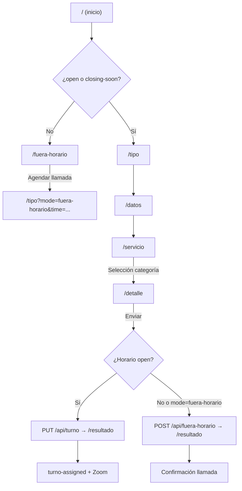

## Arquitectura

### Estructura de directorios

> Detalle ampliado en [`docs/architecture.md`](docs/architecture.md).

```
campus360-hub/
├── proxy.ts                      # Redirecciones por horario (Next.js 16)
├── app/                          # App Router de Next.js
│   ├── layout.tsx                # Layout raíz
│   ├── page.tsx                  # Redirección según horario
│   ├── globals.css               # Estilos globales
│   ├── fuera-horario/            # Pantalla fuera de horario
│   ├── (form)/                   # Grupo de rutas del wizard
│   │   ├── layout.tsx            # Shell del formulario
│   │   ├── tipo/                 # Paso 1: estudiante / aspirante
│   │   ├── datos/                # Paso 2: datos personales
│   │   ├── servicio/             # Paso 3: catálogo de categorías
│   │   ├── detalle/              # Paso 4: requerimiento + texto libre
│   │   └── resultado/            # Paso 5: turno o autogestión
│   └── api/                      # Route Handlers
├── components/
│   ├── wizard/                   # Componentes del wizard
│   ├── ui/                       # Inputs, selects, etc.
│   └── ...
├── contexts/
│   └── FormContext.tsx           # Estado global del wizard
├── hooks/                        # Lógica reutilizable del wizard
├── lib/
│   ├── schedule-core.ts          # Lógica pura de horarios Ecuador
│   ├── business-hours.ts         # API cliente de horarios
│   ├── validation.ts             # Validación de formularios
│   └── server/                   # Redis, Power Automate, rate limit
│       ├── schedule-service.ts
│       ├── power-automate.ts
│       └── api-utilities.ts
└── tailwind.config.ts            # Paleta de colores UTPL
```

### Flujo del usuario



### Horario de atención

Zona horaria: **America/Guayaquil**. Configuración dinámica desde SharePoint (`Config-horarios`) vía `POST /api/refresh-config`.

| Estado | Condición |
|--------|-----------|
| `open` | Dentro de franja activa hasta **cierre − 10 min** |
| `closing-soon` | Últimos 10 min antes del cierre PA (modal en wizard) |
| `lunch` | Hueco entre mañana y tarde (solo Horario Normal dual) |
| `after-hours` | Fuera de franja, fin de semana sin Extendido habilitado, o ambos perfiles deshabilitados |

Perfiles:

- **Horario Normal** (dual): solo **lunes a viernes**. Si ambos perfiles están `habilitado=Si`, gana Normal entre semana.
- **Horario Extendido** (continuo o dual): puede operar **lunes a domingo** cuando `habilitado=Si`. En **sábado y domingo** solo aplica Extendido; Normal no se evalúa en fin de semana.

Para abrir solo fines de semana: habilitar Extendido y mantener Normal activo entre semana. Para un periodo extendido de toda la semana: habilitar Extendido y deshabilitar Normal en Power Apps.

`proxy.ts` redirige `/` y bloquea las rutas del wizard en `lunch` y `after-hours` (salvo `?mode=fuera-horario`). El wizard permite `open` y `closing-soon`; `BusinessHoursWatcher` complementa con polling en cliente.
