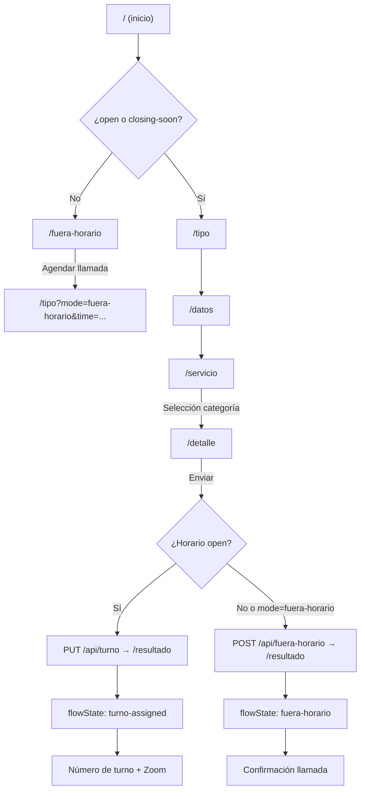

# Arquitectura — Campus360 Hub

Documento de referencia alineado con el código en `main`. Última revisión: julio 2026.

**URL de producción:** https://campus360-hub-eight.vercel.app

**Informe institucional (stakeholders UTPL):** [informe-tecnico-canal-virtual.md](./informe-tecnico-canal-virtual.md)

## Resumen

Campus360 Hub es una aplicación **Next.js 16 (App Router)** que guía a estudiantes, aspirantes y visitantes por un wizard multipaso. El estado del horario de atención (Ecuador, `America/Guayaquil`) se obtiene desde **Upstash Redis** (sincronizado vía Power Automate) y controla redirecciones en el borde (`proxy.ts`) y en el cliente (`BusinessHoursWatcher`).

---

## Estructura de directorios (real)

```
campus360-hub/
├── proxy.ts                      # Redirecciones por horario (sustituye middleware.ts)
├── app/
│   ├── layout.tsx                # Layout raíz
│   ├── page.tsx                  # Redirección SSR: /tipo o /fuera-horario
│   ├── globals.css
│   ├── fuera-horario/            # Pantalla cerrado / almuerzo / fuera de horario
│   ├── (form)/                   # Grupo de rutas del wizard
│   │   ├── layout.tsx            # Shell, banner, modales, hidratación de horarios
│   │   ├── tipo/                 # Paso 1: estudiante / aspirante
│   │   ├── datos/                # Paso 2: datos personales
│   │   ├── servicio/             # Paso 3: catálogo de categorías (API)
│   │   ├── detalle/              # Paso 4: tipo de requerimiento + texto libre
│   │   └── resultado/            # Paso 5: turno, llamada o autogestión
│   └── api/                      # Route Handlers REST
│       ├── schedule-config/      # GET estado y horarios
│       ├── refresh-config/       # POST sync horarios (SharePoint)
│       ├── avisos/               # GET banner + POST refresh
│       ├── categorias/           # GET wizard + POST refresh
│       ├── turno/                # PUT asignar turno
│       ├── autogestion/          # POST autogestión
│       ├── fuera-horario/        # POST solicitud de llamada
│       ├── cerrado/              # Endpoint auxiliar
│       └── qstash-worker/        # Worker de cola
├── components/
│   ├── wizard/                   # Pasos, GuideModal, ContactTimeModal
│   ├── ui/                       # Input, Select, etc.
│   ├── BusinessHoursWatcher.tsx  # Polling cliente + redirección en wizard
│   └── ScheduleHydrator.tsx      # Hidratación de horarios en cliente
├── contexts/
│   └── FormContext.tsx           # Estado global del wizard + envío
├── hooks/                        # use-form-wizard, use-turn-assignment, etc.
├── lib/
│   ├── schedule-core.ts          # Lógica pura de horarios (Ecuador, estados)
│   ├── business-hours.ts         # Re-export cliente
│   ├── business-hours-shared.ts  # API cliente sobre schedule-core
│   ├── schedule-client-store.ts  # Store en memoria (cliente)
│   ├── navigation-utilities.ts
│   ├── validation.ts
│   ├── api-client.ts             # Cliente HTTP para APIs de turno
│   └── server/                   # Solo servidor (Route Handlers, Redis, PA)
│       ├── schedule-service.ts   # Orquestación horarios + snapshot
│       ├── schedule-kv.ts        # Lectura/escritura Redis horarios
│       ├── schedule-mapper.ts    # Mapeo payload SharePoint → HorarioRow
│       ├── api-utilities.ts      # Rate limit, IP, sanitización
│       ├── power-automate.ts     # URLs webhooks PA
│       ├── banner-service.ts
│       ├── category-service.ts
│       ├── turno-counter.ts
│       ├── turno-queue.ts
│       └── zoom.ts
├── types/                        # form, schedule, banner, category
├── data/                         # Contenido estático, guías legacy, países
└── tailwind.config.ts
```

### Elementos que **no** existen en el árbol actual

| Referencia obsoleta | Estado real |
|---------------------|-------------|
| `middleware.ts` | Reemplazado por `proxy.ts` (convención Next.js 16) |
| `prisma/` / `schema.prisma` | No presente; persistencia activa vía Redis + Power Automate |
| `lib/power-automate.ts` | Vive en `lib/server/power-automate.ts` |
| `lib/api-utilities.ts` | Vive en `lib/server/api-utilities.ts` |

---

## Capa de redirección: `proxy.ts`

`proxy.ts` exporta la función `proxy` y un `config.matcher` para:

| Ruta | Comportamiento |
|------|----------------|
| `/` | Redirige a `/tipo` si el estado permite wizard; si no, a `/fuera-horario` |
| `/tipo`, `/datos`, `/servicio`, `/detalle`, `/resultado` | Bloquea acceso si el estado no permite wizard, **excepto** `?mode=fuera-horario` |

Flujo interno:

1. Consulta estado vía `GET /api/schedule-config` (o mock `NEXT_PUBLIC_MOCK_BUSINESS_HOURS` en desarrollo).
2. `canEnterWizard(state)` → `true` solo para `open` y `closing-soon` (`isWizardAllowedState` en `lib/schedule-core.ts`).
3. Respuestas de redirección llevan cabeceras `Cache-Control: no-store`.

`app/page.tsx` duplica la lógica de `/` en el servidor (`getScheduleConfigSnapshot` + `redirect`), de modo que la raíz funciona tanto con proxy como con render SSR directo.

---

## Horario de atención

### Zona y almacenamiento

- Zona horaria: **America/Guayaquil** (UTC−5 fijo, sin DST) — `getEcuadorClock()` en `lib/schedule-core.ts`.
- Configuración dinámica: lista SharePoint `Config-horarios` → `POST /api/refresh-config` → Redis (`lib/server/schedule-kv.ts`).
- Lectura: `GET /api/schedule-config` → `getScheduleConfigSnapshot()` en `lib/server/schedule-service.ts`.

### Estados (`BusinessHoursState`)

| Estado | Condición (código) |
|--------|-------------------|
| `open` | Dentro de franja activa hasta **cierre − 10 min** (`CLOSING_BUFFER_MINUTES`) |
| `closing-soon` | Últimos 10 min antes del cierre exacto |
| `lunch` | Hueco entre bloque mañana y tarde (solo modo `dual`) |
| `after-hours` | Fuera de franja, fin de semana sin Extendido habilitado, o sin perfil activo |

### Perfiles

Definidos en `types/schedule.ts` como `Horario Normal` y `Horario Extendido`.

Resolución (`resolveActiveSchedule`):

- **Lun–vie:** si Normal está `habilitado`, gana Normal aunque Extendido también esté activo.
- **Sáb–dom:** solo se evalúa Extendido; Normal tiene `weekdayOnly: true`.
- **Ninguno activo** para el día → `hasActiveSchedule: false` → `after-hours`.

Modos de franja por perfil:

- `dual`: mañana + tarde (con estado `lunch` intermedio).
- `continuo`: un solo bloque de apertura a cierre.

### Quién aplica cada estado

| Componente | Acción |
|------------|--------|
| `proxy.ts` | Redirige `/` y bloquea rutas del wizard en `lunch` / `after-hours` (salvo `?mode=fuera-horario`) |
| `app/page.tsx` | Redirección SSR en `/` |
| `BusinessHoursWatcher` | Poll cada 30 s en rutas wizard; redirige a `/fuera-horario` si pasa a `lunch`/`after-hours`; en `closing-soon` en `/detalle` abre `ContactTimeModal` |
| `canAcceptNewTurnos()` | Solo `open` — en `closing-soon` el wizard sigue pero no se asignan turnos nuevos |

### Mock en desarrollo

`NEXT_PUBLIC_MOCK_BUSINESS_HOURS` acepta: `open`, `lunch`, `after-hours`, `closing-soon`. Solo aplica fuera de producción (`isScheduleMockEnabled()`).

---

## Flujo del usuario

### Diagrama (alineado con rutas reales)



### Rutas del wizard (`app/(form)/`)

| Paso | Ruta | Contenido |
|------|------|-----------|
| 1 | `/tipo` | Selección estudiante / aspirante → navega a `/datos` |
| 2 | `/datos` | Datos personales, modalidad (estudiante) |
| 3 | `/servicio` | Categorías desde `GET /api/categorias?audience=` |
| 4 | `/detalle` | Tipo de requerimiento (estudiante) + texto libre → `submitForm` |
| 5 | `/resultado` | `ResultCard` según `flowState` |

Ambos tipos de usuario (`estudiante` y `aspirante`) recorren **5 pasos** (`getMaxSteps` en `hooks/use-form-wizard.ts`).

### Modo fuera de horario

1. Usuario en `/fuera-horario` elige franja de contacto.
2. Navega a `/tipo?mode=fuera-horario&time=09:00%20-%2010:00`.
3. Completa wizard; en `/detalle`, `submitForm('fuera-horario', contactTime)` llama `POST /api/fuera-horario`.
4. Resultado: `flowState === 'fuera-horario'`.

### Ruta legacy de guías (no activa en UI actual)

El código conserva `GuideModal`, `data/guides.ts` y servicios con `result: 'GUIA' | 'TURNO'` en `data/services.ts`, pero **`openGuideModal()` no se invoca desde ningún componente**. El paso `/servicio` selecciona **categorías** (API Redis/SharePoint), no servicios individuales con bifurcación GUIA/TURNO. El diagrama anterior del README que mostraba esa bifurcación en `/servicio` estaba desactualizado.

Si se reactivara la guía interactiva, el flujo previsto sería: modal → «Resuelto» → `/resultado` (`completed`) o «Necesito asesor» → `/detalle` → turno.

---

## Integraciones y datos

| Fuente | Uso |
|--------|-----|
| Upstash Redis | Horarios, avisos banner, categorías wizard, contador de turnos |
| Power Automate | Crear turno, autogestión, fuera de horario, sync SharePoint |
| SharePoint | `Config-horarios`, `Bannerconfig`, `CategoriasWizard` |
| Zoom | Enlaces deep link / web por turno (`lib/server/zoom.ts`) |

La sección de esquema Prisma en el README describe un modelo de catálogo de servicios **planificado o histórico**; no está implementado en este repositorio.

---

## Despliegue

| Aspecto | Detalle |
|---------|---------|
| **Hosting** | Vercel (serverless) |
| **URL producción** | https://campus360-hub-eight.vercel.app |
| **Build** | `pnpm build` (Node.js 22.x) |
| **Config** | Variables de entorno en panel Vercel (ver [deployment.md](./deployment.md)) |

Guía operativa: [deployment.md](./deployment.md).

---

## Limitaciones serverless

La aplicación se ejecuta como funciones serverless en Vercel. Esto implica:

| Componente | Comportamiento | Impacto |
|------------|----------------|---------|
| **Rate limiting** (`lib/server/api-utilities.ts`) | `Map` en memoria por instancia | El límite de 30 req/min se aplica por instancia, no globalmente |
| **`/api/cerrado`** (`app/api/cerrado/route.ts`) | Flag `cerrado` en variable de proceso | No persiste entre invocaciones ni se comparte entre instancias |
| **Cold starts** | Primera petición tras inactividad puede tardar más | Afecta principalmente a APIs que consultan Redis |

Estas limitaciones son aceptables para el volumen actual del canal virtual. Si el tráfico crece significativamente, evaluar rate limiting centralizado (Redis) o edge middleware.

---

## Discrepancias corregidas respecto al README anterior

1. `middleware.ts` → **`proxy.ts`**
2. Árbol sin `prisma/`; añadidos `lib/server/`, `proxy.ts`, `schedule-core.ts`
3. Rutas `lib/power-automate.ts` y `lib/api-utilities.ts` movidas a `lib/server/`
4. Flujo GUIA/TURNO en `/servicio` — **no coincide** con la UI actual (categorías → detalle)
5. Agendar llamada incluye query param `time`, no solo `mode=fuera-horario`
6. Stack: Prisma y NextAuth aparecían en la tabla tecnológica pero **no están** en `package.json` ni en el árbol de código activo
