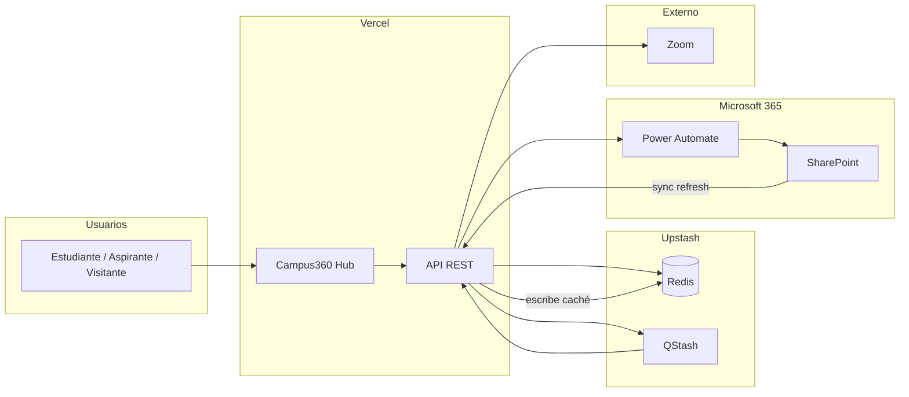

# Informe técnico del canal virtual Campus360 Hub

| Campo | Valor |
|-------|-------|
| **Institución** | Universidad Técnica Particular de Loja (UTPL) |
| **Sistema** | Campus360 Hub — Canal virtual de atención y turnos |
| **URL pública** | https://campus360-hub-eight.vercel.app |
| **Repositorio** | https://github.com/JomiChCal/campus360-hub |
| **Versión del sitio** | 0.1.0 |
| **Fecha del informe** | Julio 2026 |

---

## Resumen ejecutivo

Campus360 Hub es la plataforma web del canal virtual de atención de la UTPL. Permite a estudiantes, aspirantes y visitantes solicitar servicios académicos mediante un asistente paso a paso (wizard de cinco etapas). El sistema cubre tres modalidades de atención: autogestión con guías interactivas, asignación de turnos en horario de atención con enlace a videollamada Zoom, y registro de solicitudes fuera de horario para contacto telefónico posterior.

Las mejoras implementadas en el canal virtual incluyen horarios de atención dinámicos configurables desde SharePoint (zona horaria Ecuador), banner de avisos institucionales actualizable sin redesplegar la aplicación, catálogo de categorías de servicio administrable por tipo de usuario, numeración diaria de turnos con cola asíncrona en producción, y redirección automática según el estado del centro (abierto, cierre próximo, almuerzo o fuera de horario).

Este documento sirve como respaldo técnico para procesos institucionales de actualización de URL y como referencia para equipos de TI y administración que requieren conocer la plataforma, el alojamiento y la ubicación de la información del canal.

---

## Plataforma y tecnología

El canal virtual es una aplicación web full-stack construida con tecnologías modernas de código abierto. El frontend y el backend comparten el mismo proyecto, desplegado como funciones serverless.

| Capa | Tecnología |
|------|------------|
| **Lenguaje** | TypeScript |
| **Framework web** | Next.js 16 (App Router) |
| **Interfaz de usuario** | React 19, Tailwind CSS 4, Framer Motion |
| **API** | Route Handlers REST de Next.js |
| **Caché y turnos** | Upstash Redis |
| **Cola asíncrona** | Upstash QStash |
| **Integraciones** | Microsoft Power Automate, SharePoint, Zoom |
| **Control de versiones** | Git / GitHub |
| **Gestor de paquetes** | pnpm |

No se utiliza base de datos relacional en la versión actual del canal. La persistencia operativa se realiza mediante Redis (caché y contadores) y Power Automate (registros de atención hacia el ecosistema Microsoft de la UTPL).

Detalle técnico para desarrolladores: [stack.md](./stack.md) y [architecture.md](./architecture.md).

---

## Alojamiento e infraestructura

### Hosting

| Aspecto | Detalle |
|---------|---------|
| **Proveedor** | [Vercel](https://vercel.com) |
| **URL de producción** | https://campus360-hub-eight.vercel.app |
| **Modelo de ejecución** | Serverless (funciones por ruta, sin servidor dedicado) |
| **CDN y SSL** | Provistos por Vercel (HTTPS obligatorio en producción) |
| **Build** | `pnpm build` (Next.js) |
| **Runtime** | Node.js 22.x |

### Configuración

Las credenciales y URLs de integración **no se almacenan en el repositorio**. Se gestionan como variables de entorno en el panel de Vercel del proyecto. La plantilla de referencia está en [`.env.example`](../.env.example).

Variables críticas en producción:

- `NEXT_PUBLIC_APP_URL` — debe apuntar a `https://campus360-hub-eight.vercel.app`
- Credenciales Upstash Redis y QStash
- URLs de webhooks de Power Automate
- `REFRESH_SECRET` para sincronización desde SharePoint
- `ZOOM_MEETING_ID` para videollamadas

**Importante:** la variable `NEXT_PUBLIC_MOCK_BUSINESS_HOURS` es solo para desarrollo local. No debe estar activa en producción.

Guía de despliegue: [deployment.md](./deployment.md).

---

## Dónde se aloja la información

Esta sección describe la ubicación de cada tipo de dato del canal virtual. Es la referencia principal para respaldos de actualización de URL y auditorías de información.

| Tipo de dato | Ubicación primaria | Ubicación secundaria / caché | Retención |
|--------------|-------------------|------------------------------|-----------|
| **Horarios de atención** | SharePoint — lista `Config-horarios` | Upstash Redis (`campus360:schedule-config`) | Redis: 7 días (sync) / 6 h (fallback) |
| **Avisos del banner** | SharePoint — lista `Bannerconfig` | Upstash Redis (`campus360:banner-avisos`) | Idem |
| **Categorías del wizard** | SharePoint — lista `CategoriasWizard` | Upstash Redis (`campus360:categorias-wizard`) | Idem |
| **Numeración diaria de turnos** | Upstash Redis (`turno:DD/MM/YYYY`) | — | 24 horas |
| **Registros de turnos, autogestión y fuera de horario** | Microsoft Power Automate → backend institucional (Dataverse / SharePoint según flujo PA) | — | Según política UTPL |
| **Enlaces de videollamada** | Generados en tiempo real (Zoom) | No se persisten en Redis | Por sesión |
| **Código fuente** | GitHub (`JomiChCal/campus360-hub`) | — | Control de versiones Git |

### Diagrama de flujo de datos



### Flujo de sincronización de contenido administrable

1. Un administrador modifica un elemento en SharePoint (`Config-horarios`, `Bannerconfig` o `CategoriasWizard`).
2. Power Automate detecta el cambio y envía un POST al endpoint de refresh correspondiente.
3. La aplicación actualiza Redis con los nuevos datos.
4. Los usuarios ven el cambio al recargar la página (sin redesplegar el sitio).

---

## Integraciones externas

### Microsoft Power Automate

Power Automate es el intermediario entre el canal virtual y los sistemas institucionales de la UTPL.

| Webhook | Propósito |
|---------|-----------|
| `PA_CREAR_TURNO_URL` | Registrar turno asignado |
| `PA_CREAR_AUTOGESTION_URL` | Registrar autogestión completada |
| `PA_CREAR_FUERA_HORARIO_URL` | Registrar solicitud de llamada fuera de horario |
| `PA_ACTUALIZAR_TURNO_URL` | Actualizar o caducar turno |
| `MICROSOFT_AVISOS_FLOW_URL` | Lectura de avisos (fallback si Redis vacío) |
| `MICROSOFT_CATEGORIAS_FLOW_URL` | Lectura de categorías (fallback si Redis vacío) |

### Upstash Redis y QStash

- **Redis:** almacena horarios, avisos, categorías y el contador diario de turnos.
- **QStash:** en producción, encola la creación de turnos de forma asíncrona para evitar timeouts. En desarrollo local se llama directamente al webhook de Power Automate.

### Zoom

Cada turno asignado genera un enlace personalizado de videollamada (deep link y URL web) basado en el ID de reunión configurado en `ZOOM_MEETING_ID`.

### Panel auxiliar de asesores externos (Google Apps Script)

El directorio [`apps-script/`](../apps-script/) contiene una aplicación web independiente desplegada en Google Apps Script. Permite a asesores externos consultar turnos desde Google Sheets (`TURNOS_ASESORIA`, `ASESORES`). **No forma parte del despliegue en Vercel** del canal público, pero complementa la operación de atención en días de alta demanda.

---

## Seguridad y cumplimiento

| Medida | Descripción |
|--------|-------------|
| **HTTPS** | Todo el tráfico de producción viaja cifrado (certificado Vercel) |
| **Rate limiting** | 30 peticiones por minuto por IP en la mayoría de APIs públicas |
| **Sanitización** | Validación y limpieza de inputs en formularios y APIs |
| **Autenticación de sync** | Endpoints `*/refresh` requieren `Authorization: Bearer <REFRESH_SECRET>` |
| **Secretos** | Credenciales solo en variables de entorno de Vercel, nunca en el repositorio |
| **Datos personales** | El wizard recopila nombres, cédula, email, teléfono y país. Estos datos se envían a Power Automate para el proceso de atención. El tratamiento debe alinearse con las políticas de protección de datos de la UTPL |

Limitaciones conocidas en arquitectura serverless:

- El rate limiting y el endpoint auxiliar `/api/cerrado` operan en memoria por instancia; no se comparten entre múltiples instancias simultáneas.

---

## Mejoras implementadas en el canal virtual

| Mejora | Beneficio |
|--------|-----------|
| **Wizard multipaso (5 etapas)** | Guía estructurada para estudiantes, aspirantes y visitantes |
| **Horario Ecuador dinámico** | Horario Normal (lun–vie) y Extendido (puede incluir fines de semana) configurables sin código |
| **Modo fuera de horario** | Redirección automática y opción de agendar franja de llamada |
| **Banner de avisos** | Comunicaciones institucionales actualizables desde SharePoint |
| **Categorías configurables** | Catálogo de servicios por tipo de usuario sin redesplegar |
| **Turnos con numeración diaria** | Secuencia `001`, `002`, … con reintentos ante condiciones de carrera |
| **Integración Zoom** | Enlace de videollamada personalizado por turno |
| **Cierre próximo** | Aviso al usuario en los últimos 10 minutos de atención |
| **Diseño institucional UTPL** | Identidad visual coherente con la universidad |
| **Advertencia en móviles** | Recomendación de usar escritorio para mejor experiencia |

---

## URLs y rutas públicas

### URL base

**https://campus360-hub-eight.vercel.app**

### Rutas principales del usuario

| Ruta | Propósito |
|------|-----------|
| `/` | Redirección según horario → `/tipo` o `/fuera-horario` |
| `/tipo` | Paso 1: selección de tipo de usuario |
| `/datos` | Paso 2: datos personales |
| `/servicio` | Paso 3: categoría de servicio |
| `/detalle` | Paso 4: detalle del requerimiento |
| `/resultado` | Paso 5: confirmación (turno, llamada o autogestión) |
| `/fuera-horario` | Pantalla cuando el centro está cerrado o en almuerzo |

### APIs públicas (resumen)

| Endpoint | Método | Propósito |
|----------|--------|-----------|
| `/api/turno` | PUT | Asignar turno |
| `/api/autogestion` | POST | Registrar autogestión |
| `/api/fuera-horario` | POST | Solicitar llamada fuera de horario |
| `/api/avisos` | GET | Obtener avisos del banner |
| `/api/categorias` | GET | Obtener categorías del wizard |
| `/api/schedule-config` | GET | Obtener horarios y estado actual |

Endpoints de sincronización (`*/refresh`) y worker interno (`/api/qstash-worker`) no están expuestos al usuario final.

Documentación API completa: [api/README.md](./api/README.md).

---

## Mantenimiento y documentación relacionada

### Cuándo actualizar este informe

- Cambio de URL de producción o dominio personalizado
- Migración de proveedor de hosting (salida de Vercel)
- Nuevo sistema de almacenamiento (sustitución de Redis o Power Automate)
- Incorporación de base de datos relacional
- Cambios significativos en integraciones (nuevo CRM, nuevo proveedor de videollamadas)

### Documentación técnica interna

| Documento | Audiencia |
|-----------|-----------|
| [architecture.md](./architecture.md) | Desarrolladores — estructura y flujos |
| [stack.md](./stack.md) | Desarrolladores — tecnologías |
| [deployment.md](./deployment.md) | Operaciones — despliegue en Vercel |
| [troubleshooting.md](./troubleshooting.md) | Soporte — solución de problemas |
| [api/](./api/README.md) | Integradores — referencia REST |
| [getting-started.md](./getting-started.md) | Desarrolladores — instalación local |

---

## Apéndice: checklist de documentación

```
DOCUMENTATION CHECKLIST
----------------------------------------

- [x] Clear overview and purpose
- [x] Prerequisites listed (integraciones requeridas)
- [x] Step-by-step instructions (flujo de sync SharePoint)
- [x] Code examples included (N/A — documento institucional)
- [x] Expected outputs shown (tablas de ubicación de datos)
- [x] Troubleshooting section (enlace a troubleshooting.md)
- [x] Links to related docs
- [x] Scannable structure
- [x] Appropriate for audience level
- [x] Structured logically (simple to complex)
- [x] Visual aids (diagramas mermaid)
- [x] Table of contents (secciones numeradas)
- [x] Active voice
- [x] Unambiguous platform/hosting/data location
- [x] Examples from user perspective (rutas públicas)

MAINTENANCE NOTES
----------------------------------------

Review Triggers:
- Cambio de URL de producción (actualizar portada y sección Alojamiento)
- Nuevo webhook Power Automate (actualizar tabla de integraciones)
- Migración de Redis o proveedor de caché (actualizar sección Dónde se aloja la información)
- Cambio de versión mayor del sitio (actualizar campo Versión del sitio)

Related Documentation:
- docs/architecture.md
- docs/deployment.md
- docs/stack.md
- docs/api/README.md
- docs/troubleshooting.md
```

---

**Universidad Técnica Particular de Loja** — *decide ser +*
